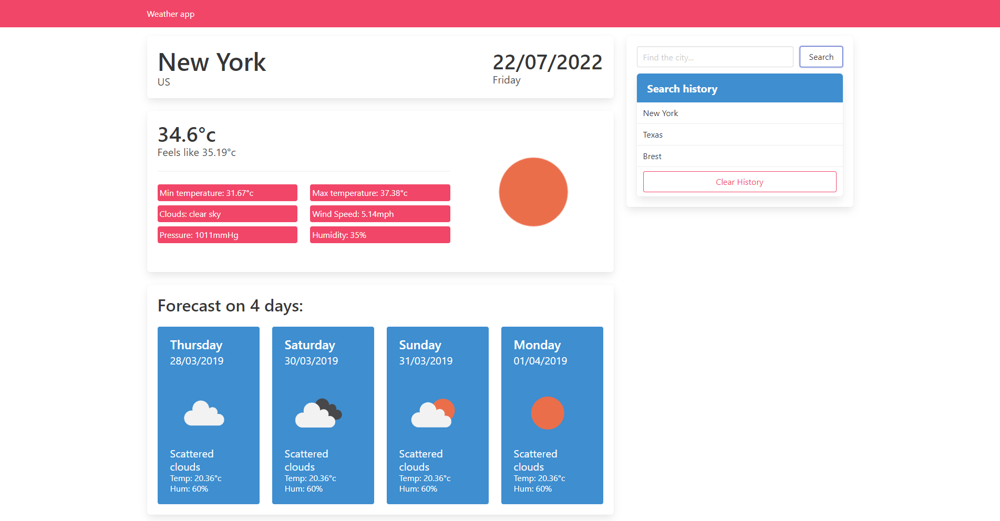

# Weather app

_The project was started a long time ago and moved from another repository. The forecast is static due to the limitation of the free plan of OpenWeather API_

To launch a project in the project directory:

```
$ npm install
$ npm start
```

Screenshot:

